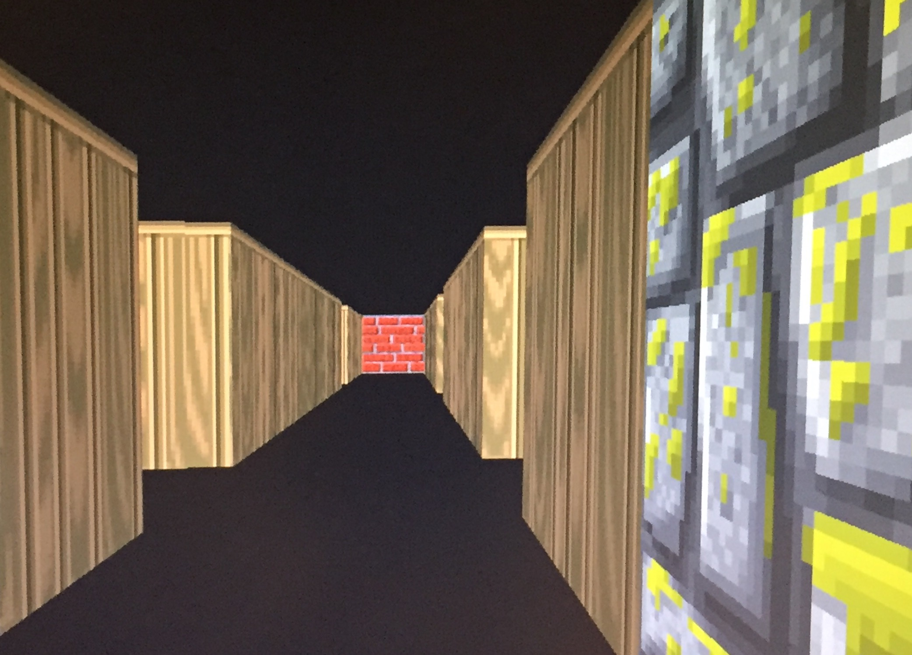
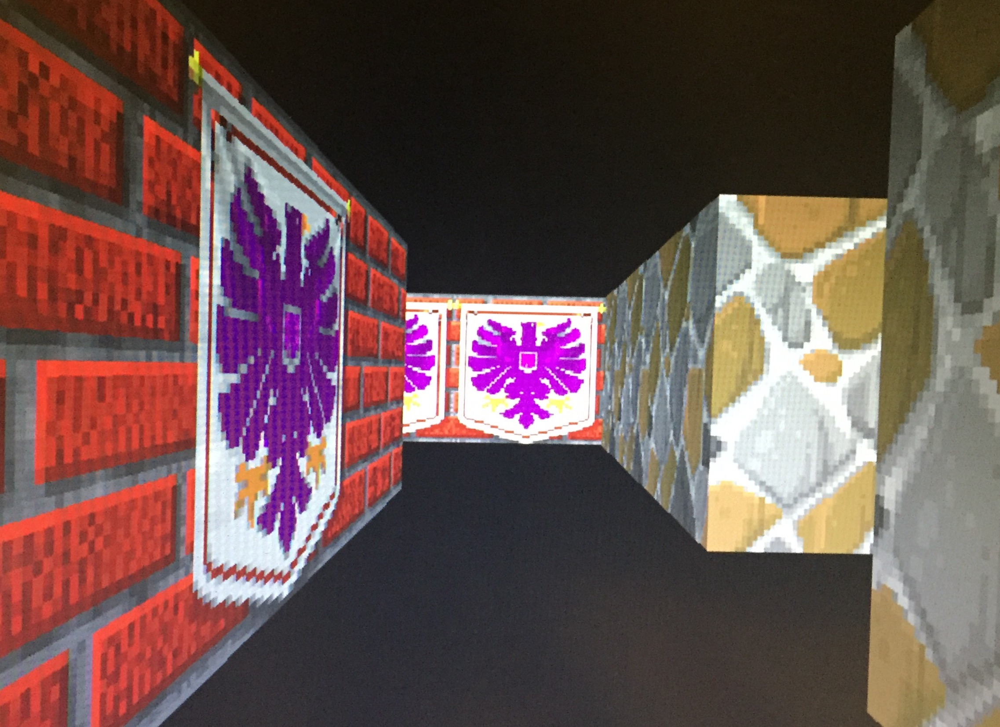
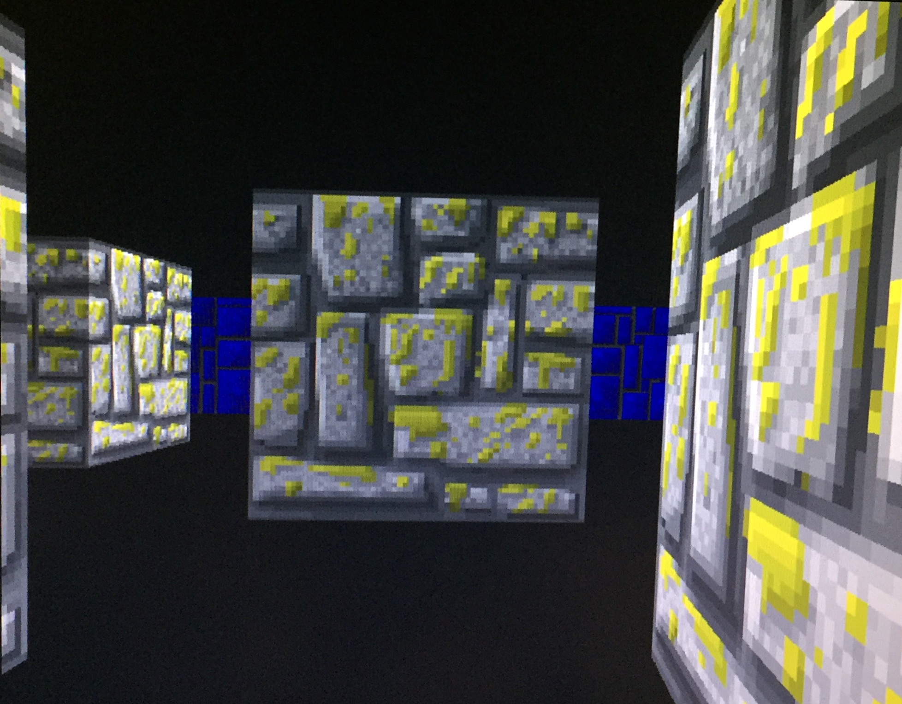
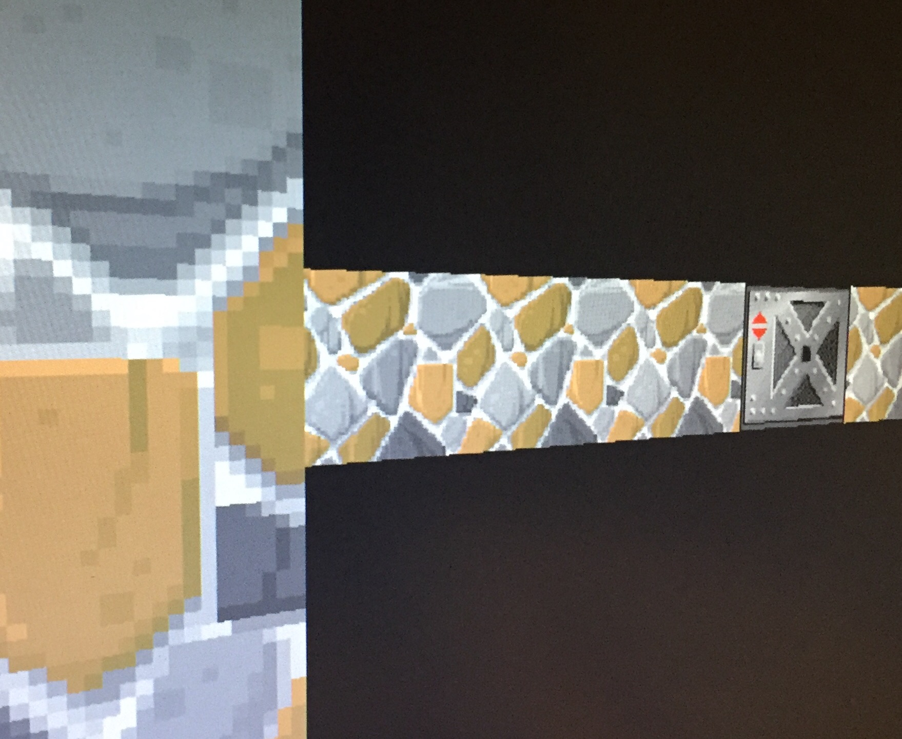
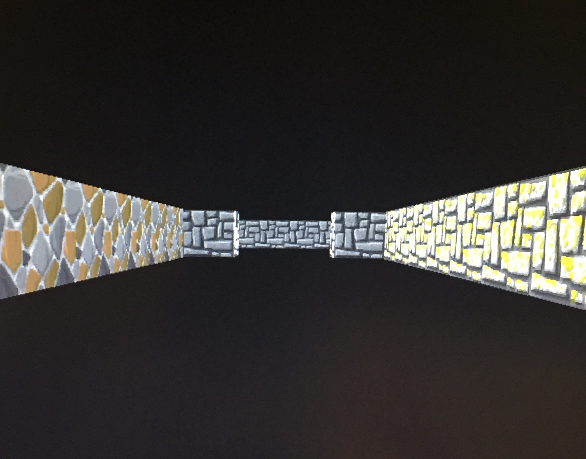
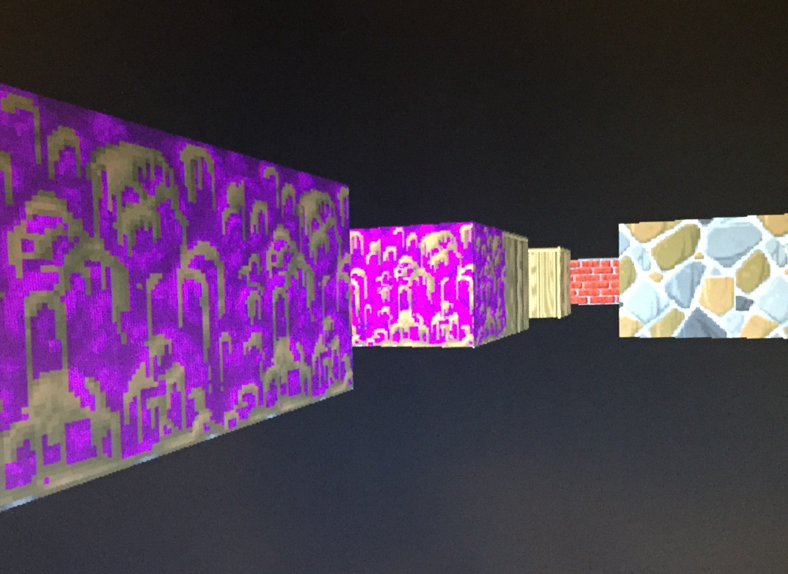

# Raycasting to build 3D worlds

## Project Description
I built a raycaster that renders navigable 3D worlds.

__Concept:__
Raycasting is a rendering technique that uses ray-surface intersection tests to lend 3D perspective to a 2D map. The concept is to use trigonometry and the properties of triangles to give the perception of depth. Ray-cast worlds typically have a 'user' who moves around, and the world is displayed in the field-of-view of the user.

__Project Features:__
* The raycasting system generates a sample maze
* It allows navigation by reading user input through the keyboard
* Walls are designed using textures from games like Wolfenstein and Doom
* Collision detection: the user cannot walk through walls

## Interface

The program opens to a simple menu that allows the user to chose from the Maze mode and the Minecraft mode. Scroll through the menu using the <kbd>&uparrow;</kbd> and <kbd>&downarrow;</kbd> arrow keys, and press <kbd>Enter</kbd> to launch the selected mode.

## Maze

In this mode, the world is a maze with two doors -- the first being the starting point, and the other the exit. The user cannot walk through walls, and must make his way to the second door. The controls are as follows:
* <kbd>&uparrow;</kbd> / <kbd>w</kbd> : move forward
* <kbd>&downarrow;</kbd> / <kbd>s</kbd> : move backwards
* <kbd>a</kbd> : move left
* <kbd>d</kbd> : move right
* <kbd>&leftarrow;</kbd> : turn left
* <kbd>&rightarrow;</kbd> : turn right
* <kbd>Space</kbd> : Rise
* <kbd>Enter</kbd> : Duck

## Minecraft

I also built a Minecraft mode which allows the user to interact with the world by more than simply navigating. This mode allows the user to break walls, add walls, and change the design of walls.

The interface for this mode is:
* <kbd>&uparrow;</kbd> / <kbd>w</kbd> : move forward
* <kbd>&downarrow;</kbd> / <kbd>s</kbd> : move backwards
* <kbd>a</kbd> : move left
* <kbd>d</kbd> : move right
* <kbd>&leftarrow;</kbd> : turn left
* <kbd>&rightarrow;</kbd> : turn right
* <kbd>Space</kbd> : Jump to upper level (not fully supported)
* <kbd>Enter</kbd> : Jump to lower level (not fully supported)
* <kbd>1</kbd> , ..., <kbd>9</kbd> : Add wall of corresponding (1, ..., 9) design
* <kbd>Backspace</kbd> : Delete the wall in front

I attempted to add multiple storeys to the world. However, there were some problems with the implementation. The texchnique I employed was to recalculate the raycast image of each storey separately, and place them atop each other by changing the y-offset, such that the central level corresponds to the level at which the main player is. The problem is that if there is an obstacle on, say, level 0, then the walls behind the obstacle would not be visible, and this works as desired when the main player is on level 0. However, when the user jumps to level 1, the portion of level 0 behind the obstacle appears black without any seeming obstruction. The solution is to calculate the overflow when a ray of light does not hit any obstacle on the current level, and let it pour into previous and latter levels. I will try to fix this in a later commit.

Note that the current version has set the variable ```max_level = 3;``` and this allows multiple levels. It is recommended that this be changed to ```max_level = 1;``` for a single-level Minecraft mode experience until the aforementioned fix is provided.

## Demo Pictures

 
 
 

## References
* Ray Casting (Wikipedia): https://en.wikipedia.org/wiki/Ray_casting
* https://permadi.com/1996/05/ray-casting-tutorial-table-of-contents/
* http://www.wolfenstein3d.co.uk/
* https://dev.opera.com/articles/3d-games-with-canvas-and-raycasting-part-1/
