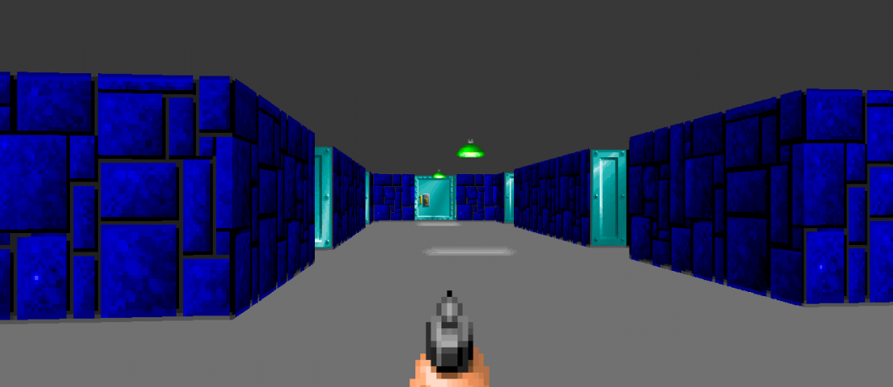

# Raycasting to build 3D worlds

Team: Manan Rai

## Project Description
The idea is to build navigable 3D worlds using raycasting. Raycasting is a rendering technique that uses ray-surface intersection tests to lend 3D perspective to a 2D map. The concept is to use trigonometry and the properties of triangles to give the perception of depth. Ray-cast worlds typically have a 'user' who moves around, and the world is displayed in the field-of-view of the user.

This is a scene from the game Wolfenstein 3D, which used raycasting to draw the worlds.

__Task breakdown:__
* Building a raycasting system to generate a world, given a static field of view
* Allowing navigation by reading user input through the keyboard
* Adding textures and improving the aesthetics of the world
* Adding objects and collision detection to the world
* Speed optimisation

__Hardware:__ Raspberry Pi, interfaced with a keyboard and monitor

__Goals for the next week:__
* I plan to create the raycasting program and to get user navigation to work
* I also plan to add collision detection
* In the subsequent week, I plan to optimise for speed, and improve the aesthetics of the world

## References
* Ray Casting (Wikipedia): https://en.wikipedia.org/wiki/Ray_casting
* https://permadi.com/1996/05/ray-casting-tutorial-table-of-contents/
